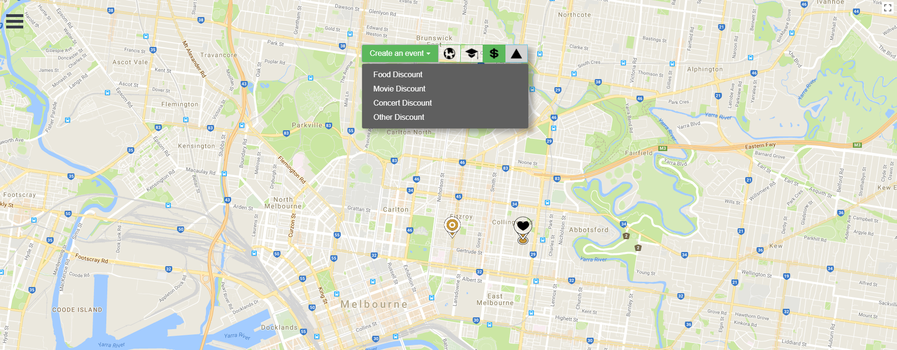
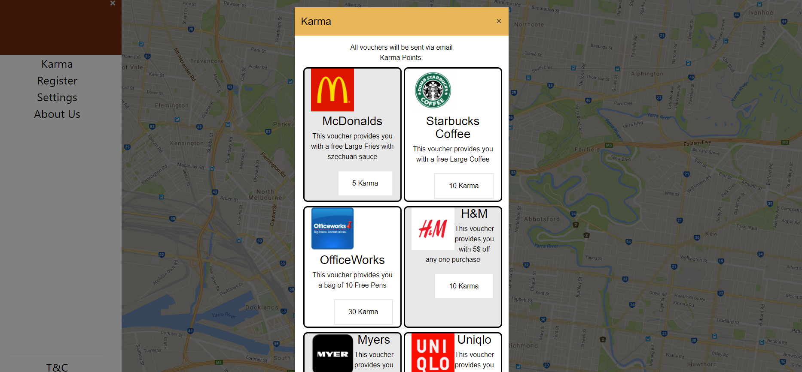

# Single-Page-Web-Application
Google Map Meet up Web Application with Karma Points

Using :	HTML, CSS, JavaScript, Bootstrap, Mongo, GraphQL, Relay, React, Node

Sample Images

## Running:
You will need `docker` and `docker-compose` installed, [instructions](https://docs.docker.com/compose/install/).

### Development:
`docker-compose -f docker-compose.yml -f docker-compose-dev.yml up --build`
### Production:
`docker-compose build --pull --no-cache --force-rm && docker-compose up --remove-orphans -d`

However, if deploying, it might be easier to use `./deploy.sh`

## Other Tips:
net stop http
## Runs on:
localhost
## To Turn off:
Docker-compose down

## To Create User:
mutation addEvent{
 addUser(input: {
   email: "XXX",
   password: "XXX",
   clientMutationId: "1"
 }) {
   clientMutationId
 }
}
